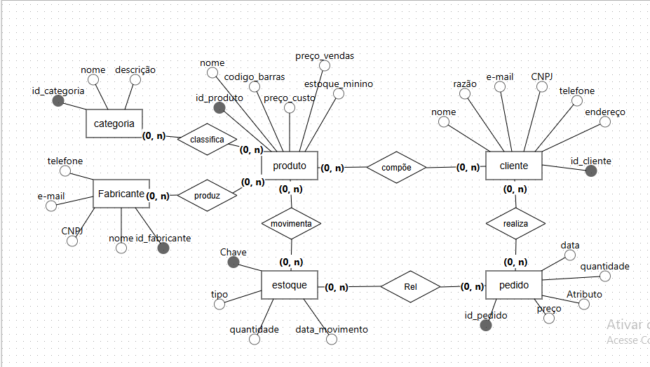

# Projeto-banco-dados

## Nome 
Distribuidor de produtos

## Tema
Esse trabalho é um sistema feito pra ajudar distribuidoras de produtos a se organizarem melhor.

## Descrição do problema
O sistema foi feito para resolver problemas de gestão em distribuidoras de produtos. O sistema ajuda em muitas coisas, algumas delas são: cadastros de fabricanates e clientes, controles de estoques, registro de pedidos e vendas.

## Entidades e Relacionamentos
### Entidades 
Fabricantes: Fornecem os produtos para a distribuidora.
Categorias: Classificação dos produtos, (alimentos, limpeza).
Produtos: Itens que são comprados, contém a informação do preço e estoque. 
Clientes: Os estabelecimentos que compram da distribuidora.
Pedidos: Registro das vendas realizadas.
Itens_Pedido: Certos produtos pedidos.
Estoque: Entrade e saída de produtos.

### Relacionamentos
Um fabricante pode fornecer vários produtos
Uma categoria pode ter vários produtos
Um cliente pode fazer vários pedidos
Um pedido pode ter vários itens
Um produto pode ter várias movimentações no estoque

## Imagem consultas 

## Imagem Br Modelo
Modelo Conceitual

Modelo Logico
